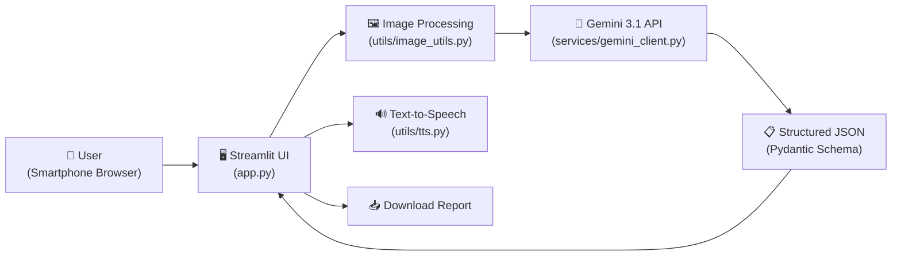

# 🌱 AgriLens — Your AI Plant Doctor

> Upload a photo of a sick plant leaf → get an instant diagnosis with treatment steps in **English or Urdu**.

Built for **WarriorHacks 2.0** | Theme: *Solving a problem in your community*

---

## 🎯 The Problem

Small farmers and home gardeners in Pakistan often **cannot quickly identify plant diseases or pests** and have limited access to agronomists. This leads to:
- 🌾 **Crop losses** worth billions of PKR annually
- 🧪 **Misuse of pesticides** — wrong chemicals, wrong dosage, health risks
- 📉 **Food insecurity** for families who depend on small-scale farming

## 💡 The Solution

**AgriLens** is a free, mobile-friendly web app that lets anyone:
1. 📸 Take or upload a photo of a sick plant leaf
2. 🤖 Get an AI-powered diagnosis in seconds
3. 🌿 Receive **organic-first** treatment steps in plain Urdu or English
4. 🔊 **Listen** to the results via text-to-speech (accessibility for low-literacy users)
5. 📥 Download a text report to share with a local expert

No sign-up. No payment. Works on any smartphone browser.

---

## 🖼️ Screenshots

| Upload / Camera | Diagnosis Result | Download Report |
|---|---|---|
| *screenshot_upload.png* | *screenshot_result.png* | *screenshot_download.png* |

> Replace the placeholders above with actual screenshots before submission.

---

## 🏗️ Architecture



---

## 🚀 How to Run Locally

### Prerequisites
- Python 3.10+
- A [Google AI Studio](https://aistudio.google.com/) API key (free tier)

### Setup
```bash
# 1. Clone the repo
git clone https://github.com/YOUR_USERNAME/agrilens.git
cd agrilens

# 2. Create and activate virtual environment
python -m venv venv
# Windows:
.\venv\Scripts\Activate.ps1
# macOS/Linux:
source venv/bin/activate

# 3. Install dependencies
pip install -r requirements.txt

# 4. Create your .env file
cp .env.example .env
# Edit .env and paste your Gemini API key

# 5. Run the app
streamlit run app.py
```

The app will open at `http://localhost:8501`.

---

## 📁 Project Structure

```
agrilens/
├── app.py                       # Main Streamlit UI
├── prompts.py                   # System prompt + Pydantic JSON schema
├── services/
│   └── gemini_client.py         # Gemini API calls with retry/backoff
├── utils/
│   ├── image_utils.py           # Image resize & compression
│   └── tts.py                   # Text-to-speech (gTTS)
├── tests/
│   ├── test_image_utils.py      # Unit tests — image processing
│   ├── test_gemini_client.py    # Unit tests — API response parsing
│   └── cli_test.py              # Manual CLI smoke test
├── sample_images/               # Test images (healthy & diseased)
├── .env.example                 # Template for environment variables
├── .gitignore
├── requirements.txt             # Pinned dependencies
└── README.md
```

---

## 🛠️ Tech Stack

| Layer | Technology | Why |
|---|---|---|
| **Frontend** | Streamlit | Mobile-friendly, rapid prototyping, zero JS needed |
| **AI Model** | Google Gemini 3.1 (google-genai SDK) | Free-tier multimodal vision + structured JSON output |
| **Image Processing** | Pillow | Resize/compress to save bandwidth on poor connections |
| **Text-to-Speech** | gTTS (Google TTS) | Free, supports Urdu, enables audio accessibility |
| **Schema Validation** | Pydantic | Guarantees consistent, type-safe API responses |
| **Deployment** | Streamlit Community Cloud | Free hosting with GitHub integration |

---

## ✨ Key Features

- **📸 Dual Input** — Camera capture or file upload
- **🌍 Bilingual** — Full English and Urdu support
- **🌿 Organic-First** — Always suggests low-cost natural remedies before chemicals
- **⚠️ Safety Guardrails** — Never recommends exact chemical dosages; always says "follow the label"
- **🔒 Privacy** — Images are processed in memory only; nothing is stored permanently
- **🔄 Resilient** — Exponential backoff retries on API rate limits
- **🔊 Listen Button** — Text-to-speech for farmers who prefer audio
- **📥 Downloadable Report** — Save and share the diagnosis offline
- **📱 Mobile-Optimized** — Works on basic smartphones with slow internet

---

## ⚠️ Limitations & Future Work

### Current Limitations
- Diagnosis accuracy depends on image quality and Gemini's training data
- Requires internet connection (no offline mode yet)
- Limited to visual symptoms; cannot analyze soil or roots from photos

### Future Roadmap
- 🗺️ **Regional disease database** — Common diseases by district/province
- 📊 **Impact dashboard** — Track scan volume and most common problems
- 🌐 **More languages** — Sindhi, Punjabi, Pashto
- 📴 **Offline mode** — Cache common diagnoses for areas with no connectivity
- 🤝 **Expert connect** — Link farmers to nearby agriculture extension offices

---

## 🔒 Security & Privacy

- API keys are loaded from environment variables only — never hardcoded or committed.
- User photos are processed **in memory** and discarded after diagnosis. No images are stored on any server.
- All chemical treatment suggestions include safety warnings and defer to product labels.

---

## 👥 Team

- **Junaid** — Full-stack development, AI integration, UI/UX

---

## 📜 License

This project was built for WarriorHacks 2.0. Open source under the [MIT License](LICENSE).

---

> 🌾 *"Every farmer deserves a plant doctor in their pocket."*
